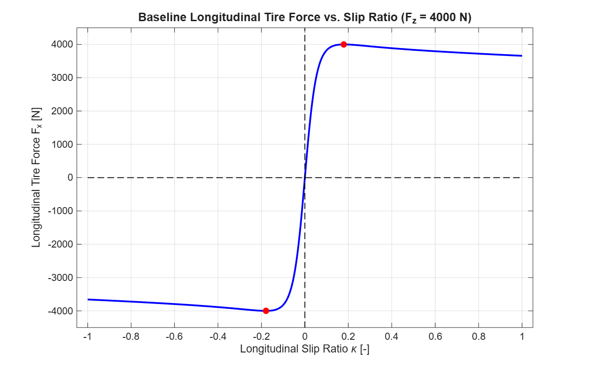

# Tire Grip and Four-Wheel Vehicle Dynamics on Snow: A Preliminary Snow-Chain Sensitivity Study

## 1. Project Overview
This project develops a transparent MATLAB framework for studying:
- Longitudinal tire slip
- Tire-force generation
- Four-wheel vehicle kinematics
- Lateral tire forces
- Combined longitudinal and lateral slip
- Dynamic normal-load transfer
- Wheel-level force distribution
- Yaw moments
- Four-wheel vehicle motion
- Time-domain simulation
- Vehicle trajectory and handling-related metrics
- Snow-road modelling
- A simplified snow-chain sensitivity study

The framework was developed incrementally and tested for implementation consistency.

## 2. Research Motivation
This preliminary MATLAB-based computational research project began with a fundamental curiosity: how do snow chains influence longitudinal tire traction, and how does that change propagate to the motion of a four-wheel vehicle on snow? 

The objective was to establish a mathematically clear, verifiable tire and vehicle dynamics foundation to conduct controlled sensitivity benchmarks on winter surfaces. It is an independently developed research and learning framework, not an industrial-grade simulator.

## 3. What Was Implemented
The mathematical models and numerical simulations include:
- An empirical Magic Formula tire-force representation
- A coupled longitudinal and lateral slip calculation module
- A planar four-wheel vehicle dynamics solver
- A 4th-order Runge-Kutta (RK4) time-domain simulation
- A modular road-condition parameter factory (Phase 3J)
- A simplified snow-chain sensitivity benchmarking script (Phase 3K)

## 4. Modelling Approach
The foundation of the tire model is the Magic Formula, representing longitudinal tire force `Fx` as:

**Fx = Fz × D × sin{ C × tan⁻¹[ Bκ − E × (Bκ − tan⁻¹(Bκ)) ] }**

- `κ` is longitudinal slip ratio.
- `Fz` is vertical tire load.
- `B`, `C`, `D`, and `E` are Magic Formula parameters.
- `tan⁻¹` means inverse tangent, equivalent to MATLAB’s `atan`.
- `D` is treated as a dimensionless peak-factor parameter in this simplified model.

The parameter `D` is a mathematical scale factor in the continuous equation. It must not be presented as a universal or directly measured tire-road friction coefficient.

## 5. Snow-Chain Sensitivity Case
To study the vehicle-level effects of a change in traction, a controlled benchmark compares a parameterized baseline `Snow` condition against a modified `SnowChain` sensitivity case. The benchmark changes only the pure longitudinal Magic Formula parameter `Dx`:

- Baseline snow: `Dx = 0.30`
- Snow-chain sensitivity case: `Dx = 0.45`
- This represents a 1.5× illustrative longitudinal-force scaling.
- The lateral parameters and combined-slip parameters are kept unchanged.

The factor is an assumed sensitivity parameter, not a measured or universally valid snow-chain coefficient. The results should not be interpreted as experimental proof or a universal prediction of real snow-chain performance. It is not a complete physical snow-chain tire model. Detailed chain-contact, tread, digging, friction, or snow-deformation mechanisms are not implemented.

## 6. Key Results
The simulated responses for both cases are summarized below:

| Maneuver | Snow | Simplified SnowChain | Difference |
|---|---:|---:|---:|
| Straight acceleration — final speed | 3.736 m/s | 3.822 m/s | +0.086 m/s |
| Straight acceleration — peak Fx | 56.038 N | 57.335 N | +1.297 N |
| Straight braking — braking distance | 4.850 m | 4.724 m | −0.126 m |
| Constant cornering — peak Fy | 37.455 N | 37.508 N | +0.054 N |
| Constant cornering — peak yaw rate | 0.159 rad/s | 0.135 rad/s | −0.024 rad/s |
| Constant cornering — final lateral deviation | 1.063 m | 0.944 m | −0.119 m |

These are results from the implemented simplified simulation, not real-world measurements.

## 7. Results and Visualizations

### Dynamic Longitudinal Force vs. Slip

This diagnostic shows the dynamic longitudinal tire-force response against longitudinal slip ratio.

### Straight Braking Distance

This shows a comparison of simulated braking distance for Snow and the simplified SnowChain sensitivity case.

### Cornering Trajectory

This diagnostic shows a comparison of simulated cornering trajectories and altered yaw response.

### Dynamic Force Trace

This is a dynamic combined longitudinal and lateral tire-force trace.

### Baseline Longitudinal Tire Force

This plot illustrates the empirical sweeps generated by the baseline tire condition.

## 8. Verification
**225/225 verification tests passed**

Verification establishes:
- Regression and implementation-consistency testing
- Checks for expected outputs and model behavior
- Protection against accidental code changes
- Numerical execution checks

Passing these tests does not prove physical validity, experimental accuracy, real-world snow-chain performance, complete vehicle-model correctness, or research-grade validation.

## 9. Limitations
The current computational framework relies on simplified mathematical assumptions. It does not yet include:
- Experimental tire or vehicle data
- Parameter identification from measurements
- Calibration against measured snow or ice tests
- Detailed tire–snow or tire–ice contact mechanics
- Temperature, moisture, snow density, or snow compaction effects
- Detailed tread-block or chain-link interaction
- A measured snow-chain coefficient model
- Advanced transient tire behavior

## 10. Future Research Direction
Future work may include:
- Learning more advanced tire and vehicle simulation methods
- Studying realistic tire–snow and tire–ice interaction
- Investigating black-ice conditions
- Incorporating temperature, moisture, density, and compaction effects
- Studying tread and rubber-compound effects
- Using experimental data for parameter identification
- Calibrating and validating the model against measurements
- Improving transient tire-force and vehicle-response modelling
- Developing a more physically grounded snow-chain representation

## 11. Repository Structure
- `matlab/tire/`: Fundamental equations for slip, pure forces, and combined-slip modifications.
- `matlab/vehicle/`: Kinematics, load transfer, and four-wheel dynamics.
- `matlab/simulation/`: Time-domain RK4 integration and verification scripts.
- `matlab/analysis/`: Maneuver wrappers, metric extraction, and Phase 3K snow-chain benchmarking.
- `docs/theory/`: Mathematical formulation and design rationale.
- `results/`: Verified output data, diagnostic metrics, and comparative plots.

## 12. Reproducibility
Principal MATLAB entry points:
- `matlab/analysis/runSnowChainBenchmark.m`
- `matlab/analysis/runSnowChainResults.m`
- `matlab/simulation/verifySnowChainBenchmark.m`

Figures are stored under:
- `results/figures/`

Detailed numerical results should be documented in:
- `results/README.md`

Supporting theory documents are stored under:
- `docs/theory/`

## 13. References / Further Reading
The project is informed by literature on empirical tire-force modelling, combined tire forces, vehicle dynamics, tire–snow interaction, tire–ice interaction, snow-chain traction, and experimental parameter identification.

A detailed list of referenced literature can be found in:
[docs/references.md](docs/references.md)
