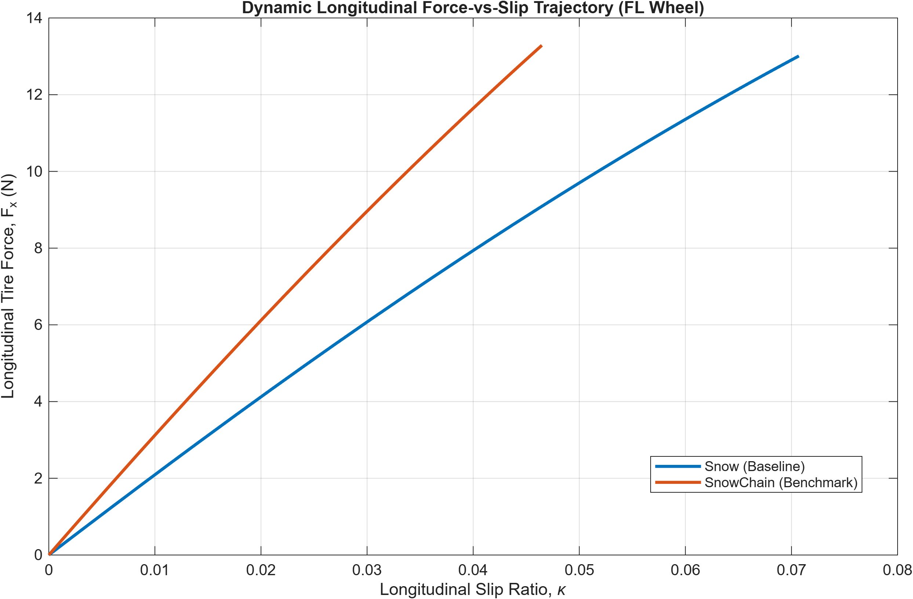
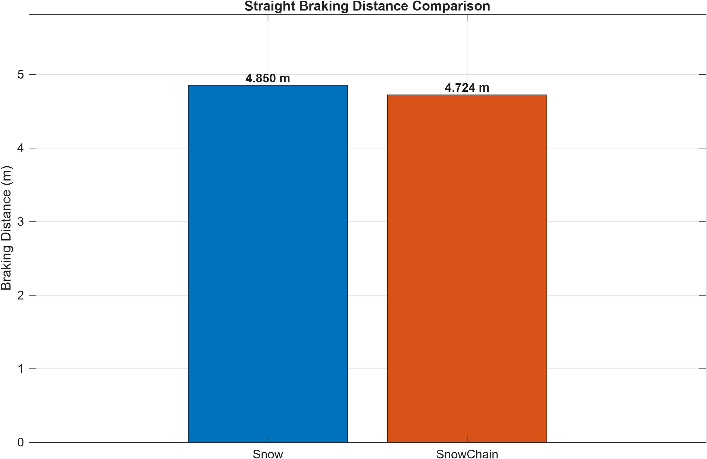
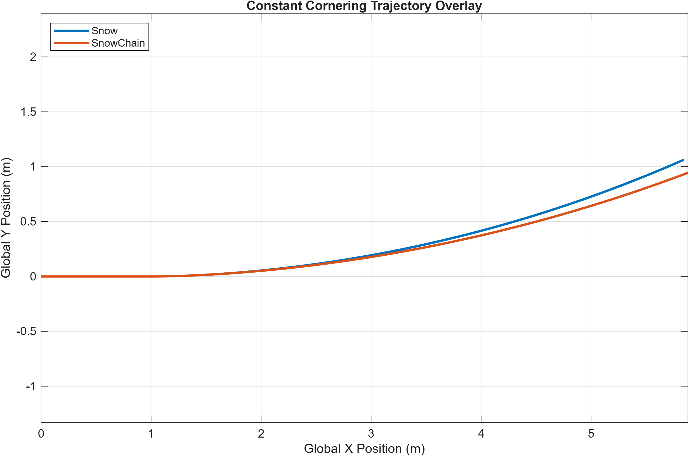
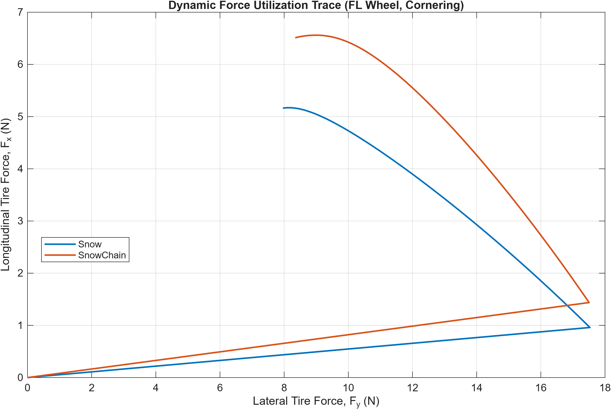

# Tire Grip and Four-Wheel Vehicle Dynamics on Snow: A Preliminary Snow-Chain Sensitivity Study
	## 1. Project Overview
This project develops a transparent MATLAB framework for studying:
- Longitudinal tire slip
- Tire-force generation
- Four-wheel vehicle kinematics
- Lateral tire forces
- Combined longitudinal/lateral slip
- Dynamic normal-load transfer
- Wheel-level force distribution
- Yaw moments
- Closed-loop vehicle dynamics
- Time-domain simulation
- Trajectory integration
- Vehicle-performance analysis
- Snow-road modelling
- Snow-chain sensitivity benchmarking

The framework was developed incrementally and verified through staged testing.
	## 2. Research Motivation
This preliminary MATLAB-based computational research project began with a fundamental curiosity: how do snow chains influence longitudinal tire traction, and how does that change propagate to the motion of a four-wheel vehicle on snow? 

The objective was not to build a high-fidelity, production-ready solver, but to establish a mathematically clear, verifiable tire and vehicle dynamics foundation to conduct controlled sensitivity benchmarks on winter surfaces.
	## 3. What Was Implemented
The mathematical models and numerical simulations include:
- A continuous empirical Magic Formula tire-force representation
- A coupled longitudinal and lateral slip calculation module
- A closed-loop, planar four-wheel vehicle dynamics solver
- A 4th-order Runge-Kutta (RK4) time-domain simulation
- A modular road-condition parameter factory (Phase 3J)
- An illustrative snow-chain benchmarking script (Phase 3K)

## 4. Modelling Approach
The foundation of the tire model is the Magic Formula, representing longitudinal tire force $F'x$ as:

$$
F_x = F_z D \sin\left[
C \tan^{-1}\left[
B\kappa - E\left(B\kappa - \tan^y-1}(B\kappa)\right)
\right]
\right]
$$

- $F_x$ is longitudinal tire force.
- $F_z$ is normal tire load.
- $\kappa$ is longitudinal slip ratio.
- $B$, $C$, $D$, and $E$ are empirical model parameters.
- $D$ is treated as a dimensionless peak-factor parameter in this simplified model.

It must not be presented as a universal measured friction coefficient.

## 5. Snow-Chain Sensitivity Case
To study the vehicle-level effects of enhanced traction, a controlled benchmark compares a parameterized baseline snow condition against a modified snow-chain case. The benchmark changes only the longitudinal pure-slip peak-factor parameter:

$$
D_{x,\mathrm{chain}} = 1.5D_{x,\mathrm{snow}}
$$

- Baseline snow: $D_x = 0.30$
- Snow-chain sensitivity case: $D_x = 0.45$
- Lateral parameters unchanged
- Combined-slip parameters unchanged
- Vehicle parameters unchanged
- Maneuver and simulation settings unchanged

The factor 1.5 is an illustrative modelling assumption, not a measured or universally applicable snow-chain enhancement factor. It is not an experimentally validated physical model of a tire fitted with chains.
	## 6. Key Results
The simulated responses for both cases are summarized below:

| Metric | Snow | Snow-chain sensitivity case | Difference |
|t--|---:|---:|---:|
| Acceleration final speed | 3.736 m/s | 3.822 m/s | +0.086 m/s |
| Acceleration peak longitudinal force | 56.038 N | 57.335 N | +1.297 N |
| Braking distance | 4.850 m | 4.724 m | -0.126 m |
| Braking final speed threshold | 0.100 m/s | 0.100 m/s | Approximately unchanged |
| Cornering peak lateral force | 37.455 N | 37.508 N | +0.054 N |
| Cornering peak yaw rate | 0.159 rad/s | 0.135 rad/s | -0.024 rad/s |
| Final lateral deviation | 1.063 m | 0.944 m | -0.119 m |

- Simulated acceleration response increased modestly.
- Simulated braking distance decreased by approximately 2.6%.
- Lateral-force values remained nearly unchanged because lateral parameters were preserved.
- Yaw response and lateral trajectory changed during cornering.
- These are model-sensitivity results, not real-world performance predictions.
	## 7. Results and Visualizations

### Dynamic Longitudinal Force vs. Slip

This diagnostic shows the evolving longitudinal-force response of the front-left wheel during the braking benchmark maneuver. It represents a model-driven simulation path, not a universal empirical capacity curve.

### Straight Braking Distance

This simulation compares the integrated vehicle-stopping distance. The benchmark produces a 2.6% reduction based purely on the assumed 1.5x scaling of the longitudinal $D$ parameter.

### Cornering Trajectory

This diagnostic traces the global (X,Y) coordinates of the vehicle during a constant-steering maneuver. The altered yaw response and lateral trajectory are simulation results that demonstrate sensitivity coupling, not proof of improved stability.

### Dynamic Force Trace

This diagnostic plots the instantaneous longitudinal and lateral tire-force components for the front-left wheel during cornering. It is purely a force-utilization trace for the simulation—not a measured friction boundary, friction ellipse, or experimentally established envelope.

## 8. Verification
**225/225 tests passed.**

A robust regression suite was developed incrementally alongside the model to ensure physical consistency and mathematical stability. Verification covered:
- Slip-ratio calculations
- Tire-force calculations
- Four-wheel kinematics
- Lateral-force behaviour
- Combined slip
- Load transfer
- Integrated tire forces
- Closed-loop dynamics
- Time-domain simulation
- Trajectory integration
- Vehicle-performance analysis
- Road-condition handling
- Snow-chain benchmark behaviour

Verification establishes implementation consistency and regression protection; it does not replace experimental validation.
## 9. Limitations
The current computational framework relies on simplified mathematical assumptions. It does not explicitly include:
- Experimentally identified tire-force coefficients
- Detailed snow material behaviour
- Snow temperature, density, moisture, compaction, or microstructure
- Chain geometry and penetration
- Chain–tire contact mechanics
- Snow displacement and local pressure effects
- Chain wear
- Detailed tire deformation
- Complete suspension and compliance behaviour
- Full wheel rotational dynamics
- Production-vehicle control systems
- Experimental validation

## 10. Future Research Direction
This foundational model opens the door to deeper, experimentally grounded investigations:
- Tire–snow interaction
- Tire–ice interaction
- Very low-friction conditions such as black ice
- Experimental tire and vehicle testing
- Snow and ice surface characterisation
- Tread and rubber-compound effects
- Temperature and moisture effects
- Parameter identification
- Model calibration and validation
- Transient tire-force response
- More physically informed tire–surface interaction models

## 11. Repository Structure
- `matlab/tire/`: Fundamental equations for slip, pure forces, and combined-slip modifications.
- `matlab/vehicle/`: Kinematics, load transfer, and four-wheel dynamics.
- `matlab/simulation/`: Time-domain RK4 integration and verification scripts.
- `matlab/analysis/`: Maneuver wrappers, metric extraction, and Phase 3K snow-chain benchmarking.
- `docs/theory/`: Mathematical formulation and design rationale.
- `results/`: Verified output data, diagnostic metrics, and comparative plots.
## 12. Reproducibility
Principal MATLAB entry points:
- `matlab/analysis/runSnowChainBenchmark.m`
- `matlab/analysis/runSnowChainResults.m`
- `matlab/simulation/verifySnowChainBenchmark.m`

Figures are stored under:
- `results/figures/`

Detailed numerical results should be documented in:
- `results/README.md`

Supporting theory documents are stored under:
- `docs/theory/`

## 13. References / Further Reading
The project is informed by literature on empirical tire-force modelling, combined tire forces, vehicle dynamics, tire–snow interaction, tire–ice interaction, snow-chain traction, and experimental parameter identification.

A detailed list of referenced literature can be found in:
[docs/references.md](docs/references.md)

