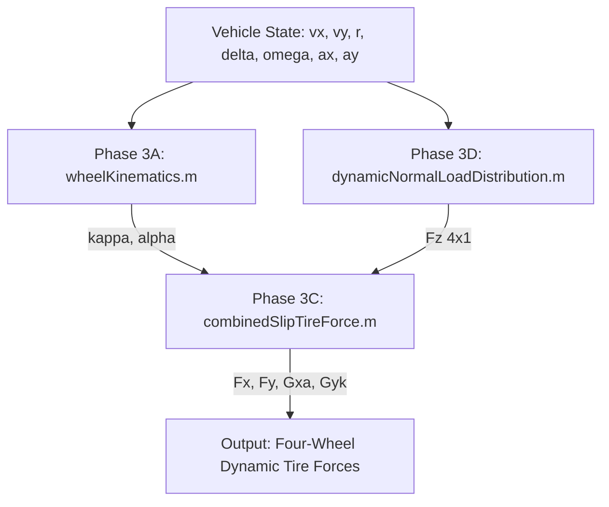

# Phase 3E: Dynamic Normal-Load / Combined-Slip Tire Force Integration

## 1. Motivation
In vehicle mobility simulation, evaluating individual wheel tire forces requires synthesizing several interdependent physical domains:
1. **Planar kinematics:** Transforming vehicle body velocities ($v_x, v_y, r$) and steering angles ($\delta$) to local wheel-frame contact velocities to determine longitudinal slip ratio ($\kappa$) and slip angle ($\alpha$).
2. **Dynamic vertical load transfer:** Determining individual wheel normal forces ($F_z$) resulting from vehicle accelerations ($a_x, a_y$).
3. **Coupled non-linear tire mechanics:** Evaluating simultaneous longitudinal ($F_x$) and lateral ($F_y$) forces under combined slip.

Phase 3E provides a modular, four-wheel integration layer (`dynamicTireForces.m`) that links these previously validated components into a unified interface without duplicating underlying equations.

---

## 2. Architecture & Data Flow

The integration function `dynamicTireForces.m` acts as an orchestrator:
1. Calls `wheelKinematics.m` to compute wheel contact velocities, slip ratios ($\kappa$), and slip angles ($\alpha$) for all four wheels.
2. Calls `dynamicNormalLoadDistribution.m` with vehicle accelerations ($a_x, a_y$) to compute quasi-static dynamic normal loads ($F_z$).
3. Passes individual $(\kappa_i, \alpha_i, F_{z,i})$ to `combinedSlipTireForce.m` (which evaluates constituent pure-slip models and Pacejka-style weighting factors $G_{x\alpha}, G_{y\kappa}$).

---

## 3. Interfaces & Wheel Ordering

### Inputs
- $v_x, v_y$: Vehicle CG longitudinal and lateral body velocities [m/s]
- $r$: Vehicle yaw rate [rad/s] (positive counter-clockwise)
- $\delta$: Front wheel steer angle [rad] (scalar or $4 \times 1$)
- $\omega$: Wheel angular rotational velocities [rad/s] ($4 \times 1$)
- $a_x, a_y$: Current vehicle longitudinal and lateral accelerations [m/s$^2$]
- `params`: Rover geometric, mass, and inertial parameters struct
- `pure_params`, `combined_params`: (Optional) Tire parameter structs

### Outputs (All $4 \times 1$ vectors)
- $F_{x,\text{wheel}}$: Longitudinal tire forces in wheel coordinates [N]
- $F_{y,\text{wheel}}$: Lateral tire forces in wheel coordinates [N]
- $F_{z,\text{wheel}}$: Dynamic normal contact forces [N]
- $\kappa$: Longitudinal slip ratios [-]
- $\alpha$: Signed wheel slip angles [rad]
- $G_{x\alpha}$: Longitudinal combined-slip weighting factors [-]
- $G_{y\kappa}$: Lateral combined-slip weighting factors [-]
- `kinematics`: Kinematic diagnostic struct

### Wheel Indexing Convention
1. Index 1: **FL** (Front-Left, $+l_f, +t_f/2$)
2. Index 2: **FR** (Front-Right, $+l_f, -t_f/2$)
3. Index 3: **RL** (Rear-Left, $-l_r, +t_r/2$)
4. Index 4: **RR** (Rear-Right, $-l_r, -t_r/2$)

---

## 4. Sign Conventions & Force Behavior

### Longitudinal Force ($F_x$)
- **Driving Slip ($\kappa > 0$):** $R\omega > v_{x,\text{wheel}} \implies F_x > 0$ (forward tractive force).
- **Braking Slip ($\kappa < 0$):** $R\omega < v_{x,\text{wheel}} \implies F_x < 0$ (braking resistance).

### Lateral Force ($F_y$)
- **Positive Steer Left ($\delta > 0$):** $v_{y,\text{wheel}} < 0 \implies \alpha < 0 \implies F_y > 0$ (restoring force directed leftward toward turn center).
- **Negative Steer Right ($\delta < 0$):** $v_{y,\text{wheel}} > 0 \implies \alpha > 0 \implies F_y < 0$ (restoring force directed rightward).

---

## 5. Explicit / Quasi-Static Coupling Boundary
> [!IMPORTANT]
> Phase 3E implements an **explicit quasi-static force evaluation** boundary. Accelerations $a_x$ and $a_y$ are supplied as explicit inputs to evaluate instantaneous normal loads $F_z$.

In a continuous simulation, true vehicle accelerations $(\dot{v}_x, \dot{v}_y)$ depend on tire forces, which depend on $F_z$, which in turn depends on acceleration ($a_x, a_y$). Phase 3E evaluates forces at specified instantaneous acceleration states without solving an implicit algebraic loop. Fully coupled implicit solving and state integration are deferred to subsequent simulation phases.

---

## 6. Mathematical Formulations Reused

### Kinematics (Phase 1A & Phase 3A)
$$\kappa_i = \frac{R\omega_i - v_{x,\text{wheel},i}}{\max(|v_{x,\text{wheel},i}|, \epsilon_{\text{slip}})}$$
$$\alpha_i = \text{atan2}(v_{y,\text{wheel},i}, v_{x,\text{wheel},i})$$

### Dynamic Normal Loads (Phase 3D)
$$F_{z,i} = F_{z,i,\text{static}} + \Delta F_{z,\text{long},i}(a_x) + \Delta F_{z,\text{lat},i}(a_y)$$
$$\sum_{i=1}^4 F_{z,i} = m \cdot g \quad (\text{strictly conserved})$$

### Combined-Slip Forces (Phase 3B & Phase 3C)
$$F_{x,i} = G_{x\alpha}(\alpha_i) \cdot F_{x0}(\kappa_i, F_{z,i})$$
$$F_{y,i} = G_{y\kappa}(\kappa_i) \cdot F_{y0}(\alpha_i, F_{z,i})$$
$$G(x) = \frac{\cos\left( C \arctan\left( B x - E(B x - \arctan(Bx)) \right) \right)}{G_0}$$

---

## 7. Assumptions & Limitations
1. **Quasi-Static Load Transfer:** High-frequency suspension transients, wheel hop, pitch/roll damping, and sprung-mass compliance are not modeled.
2. **Reduced PAC2002 Weighting:** Representative combined-slip weighting parameters are utilized; this is not a fully identified commercial PAC2002 tire parameterization.
3. **Explicit Acceleration Input:** Dynamic load transfer uses instantaneous $a_x, a_y$ without internal implicit convergence iteration.
4. **Uniform Road Surface:** Baseline dry conditions are assumed across all wheels (per-wheel asymmetric road friction is deferred).

---

## 8. Research Integrity Statement
- The Magic Formula and combined-slip coefficients used are **representative baseline parameters** for mathematical verification and rover dynamics framework development.
- They do not represent proprietary experimental measurements of a specific commercial rover tire.

---

## 9. Verification Summary
The automated test suite `verifyDynamicTireForces.m` validates 20 test cases in MATLAB R2026a:
- Static $F_z$ recovery and vertical load conservation ($\sum F_z = 588.60\,\text{N}$).
- Longitudinal and lateral load transfer effects on $F_x$ and $F_y$.
- Pure-slip recovery conditions ($G_{xa}=1, G_{yk}=1$).
- Four-quadrant sign consistency.
- Wheel-lift error propagation on rollover thresholds.
