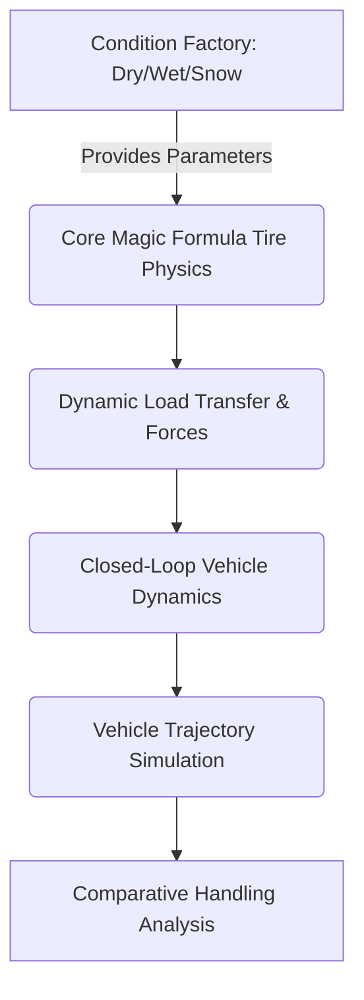

# Road-Surface Conditions (Phase 3J)

## Overview
Phase 3J introduces a strictly comparative, modular road-surface condition framework designed to sit cleanly on top of the validated Phase 1A-3I vehicle physics stack. The purpose of this layer is to facilitate deterministic performance and handling characterizations under representative environmental contexts: **Dry**, **Wet**, and **Snow**.

> [!IMPORTANT]  
> **RESEARCH INTEGRITY STATEMENT**  
> The tire parameter values defined in this module are **representative coefficient modifications selected to produce controlled differences in force capacity and slip sensitivity between surface-condition cases**. 
> They are strictly for *comparative mathematical simulation* of vehicle response. They are emphatically **NOT** experimentally measured tire data, **NOT** real-world calibrated coefficients, and **NOT** universal physical constants. 

## The Abstraction Architecture
The condition model isolates environmental assumptions from the core tire equations. The `roadSurfaceCondition.m` factory function returns structurally identical parameter sets (`pure_params`, `combined_params`) tailored to the selected condition.

This cleanly enforces the rule:

## Representative Condition Formulation

The baseline Magic Formula coefficients ($B, C, D, E$) determine the shape and magnitude of the longitudinal and lateral tire force curves. To model varying surfaces, these coefficients are systematically shifted.

Here, D is treated as a dimensionless Magic Formula peak-factor coefficient within this simplified model. It should not be interpreted as a directly measured tire-road friction coefficient or as a universal percentage friction limit. The resulting tire force depends on the complete set of Magic Formula parameters and the operating slip condition.

### Dry (Baseline)
A high-friction, stiff tire-road interface representing ideal operating conditions.
- **D (Peak factor):** 1.0 (dimensionless Magic Formula peak factor)
- **B (Stiffness factor):** 10.0 (High initial slope, tight elastic coupling)
- **C (Shape factor):** 1.9 (Classical sharp peak and characteristic drop-off)

### Wet
A compromised interface representing fluid-film interference. The peak friction limit drops, and the surface compliance alters the characteristic shape.
- **D (Peak factor):** 0.7 (dimensionless Magic Formula peak factor)
- **B (Stiffness factor):** 8.0 (Slightly increased compliance, requires slightly more slip to build load)
- **C (Shape factor):** 1.6 (Flatter peak, gentler drop-off post-saturation)

### Snow
Snow is represented here as a highly compliant, low-force-capacity tire–road condition through parameterized Magic Formula coefficients.
- **D (Peak factor):** 0.3 (dimensionless Magic Formula peak factor)
- **B (Stiffness factor):** 4.0 (Highly compliant, slow force build-up requiring significant slip)
- **C (Shape factor):** 1.2 (Minimal distinct peak, asymptotic flattening assumption representing shear-driven surfaces)

### Distinguishing the D Parameter from Friction Coefficients
* $D$ is a Magic Formula model coefficient, functioning as a representative peak-force scaling parameter.
* The resulting force depends on the complete ($B, C, D, E$) parameter set and the instantaneous slip ratio.
* Therefore, $D$ should not automatically be interpreted as a directly measured tire-road friction coefficient ($\mu$).
* The separately reported **Max $F_x/F_z$** is the maximum force-to-normal-load ratio actually obtained over the evaluated slip interval $\kappa \in [0,1]$.
* These representative parameters are not experimentally calibrated friction coefficients for a specific real-world tire/snow condition.

## Combined-Slip Mechanics
To ensure compatibility with the Phase 3C combined-slip weighting framework, the combined-slip parameters (`Bx_alpha`, `Cx_alpha`, etc.) are also adjusted. The shape factors are reduced in the Wet/Snow conditions to reflect the broader interaction boundaries on compliant surfaces.

## Evaluation Protocol
Using the `runRoadConditionComparison` wrapper, simulations are conducted strictly maintaining:
- Identical vehicle parameters (mass, geometry, CG)
- Identical initial states
- Identical maneuver definitions and durations
- Identical solver configurations

This enforces that any emergent differences in longitudinal acceleration, cornering capacity, or stopping distance are mathematically isolated to the environmental parameterization alone.

## Model Scope and Limitations

* The current tire model is a simplified continuous Magic Formula representation.
* Snow is represented through parameterized tire-force behavior rather than a physical snow material model.
* The model does not explicitly represent snow compaction, shear, digging, tread-block deformation, temperature dependence, snow depth, water content, or microstructure.
* SnowChain is represented only through a controlled longitudinal Dx sensitivity modification.
* Therefore, Phase 3K demonstrates model sensitivity and comparative behavior, not experimental prediction.
* Experimental calibration and validation are future work.
